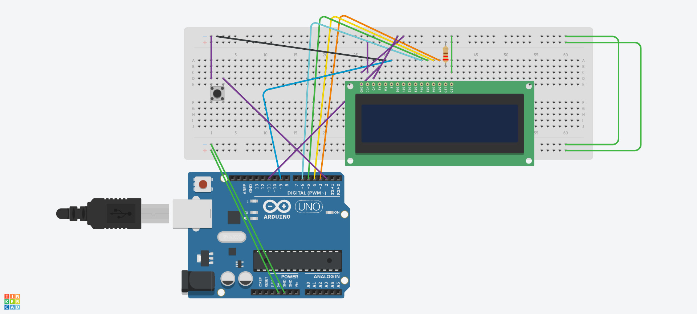

# Arduino LCD Running Game

## Requirements

- **Arduino Board**
- **16x2 LCD Display**
- **Push Button**
- Jumper wires and breadboard for setup

## How to Play

1. **Press the button** to make the hero jump.
2. **Avoid obstacles** by jumping at the right time.
3. If the hero hits an obstacle, the game shows “Game Over.”
